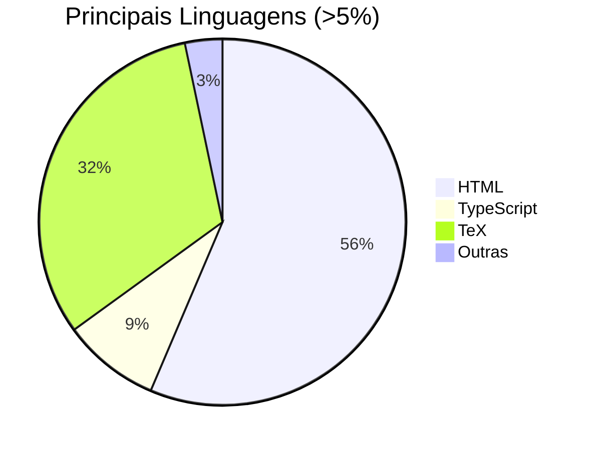
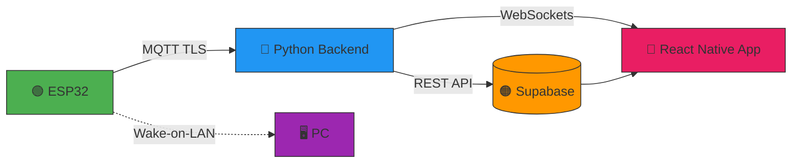
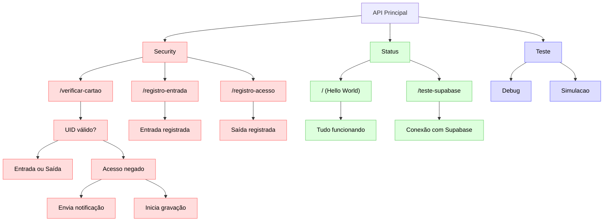

# 🔍 SALV - Sistema de Alerta Laboratorial com Visão

[](https://www.python.org/)
[](https://www.espressif.com/)
[](LICENSE)

> **Solução inteligente para segurança laboratorial**  
> Combina visão computacional, IoT e notificações em tempo real para proteção de ambientes críticos

---

## 🧭 Índice Rápido
- [✨ Visão Geral](#-visão-geral)  
- [🎯 Funcionalidades Principais](#-funcionalidades-principais)  
- [🛠️ Tecnologias Chave](#-tecnologias-chave)  
  - [🖥️ Hardware](#️-hardware)  
  - [📚 Software Stack](#-software-stack)  
- [⚡ Comece em 5 Minutos](#-comece-em-5-minutos)  
- [📐 Arquitetura do Sistema](#-arquitetura-do-sistema)  
- [📡 Comunicação e Protocolos](#-comunicação-e-protocolos)  
- [🛠️ Módulo ESP32 - Guia Completo](#-módulo-esp32---guia-completo)  
- [👥 Autores & Agradecimentos](#-autores--agradecimentos)  
 


---

## ✨ Visão Geral

O **SALV** é um sistema integrado de segurança que utiliza:

- 👁️ **Visão computacional** (YOLOv8) para detecção facial e de movimento  
- 📡 **IoT** (ESP32 + sensores) para monitoramento ambiental  
- 🔔 **Notificações instantâneas** via app mobile  

**Cenários ideais**:
- 🧪 Laboratórios com equipamentos sensíveis  
- 🏢 Salas de servidores e infraestrutura crítica  
- 🔒 Qualquer ambiente que necessite de monitoramento automatizado  

**Diferenciais**:
✅ Baixo custo de implementação  
✅ Fácil integração com sistemas existentes  
✅ Código 100% aberto e customizável  

---

## 🎯 Funcionalidades Principais

<div align="center">

| Funcionalidade               | Descrição                                                                 | Status       |
|------------------------------|---------------------------------------------------------------------------|--------------|
| **👁️ Detecção de Movimento**  | Ativa o sistema quando detecta atividade usando sensor PIR + visão computacional | ✅ Implementado |
| **🤖 Detecção Facial**        | Identifica rostos em tempo real com YOLOv8 e destaca na interface         | ✅ Implementado |
| **🪪 Autenticação por RFID**  | Controla acesso via cartões cadastrados no banco de dados                 | ✅ Implementado |
| **📹 Gravação Automática**    | Armazena vídeos de acessos não autorizados no Supabase Storage           | ✅ Implementado |
| **🔔 Notificações em Tempo Real** | Envia alertas                 | ✅ Implementado |

</div>

---

## 🛠 Tecnologias Chave

### 🖥️ Hardware

| Componente               | Função                                                                     | Especificações |
|--------------------------|----------------------------------------------------------------------------|----------------|
| **ESP32-WROOM**          | Processamento local e comunicação com sensores                             | WiFi + Bluetooth |
| **Câmera USB HD**        | Captura de imagens para análise (mínimo 720p)                             | 30 FPS         |
| **Leitor RFID-RC522**    | Autenticação de usuários via cartões                                      | 13.56 MHz      |

### 📚 Software Stack



### Principais Tecnologias:
- **Visão Computacional**: OpenCV + YOLOv8

- **IoT**: MicroPython, MQTT (HiveMQ)

- **Autenticação**: JWT, Supabase Auth

- **Armazenamento**: Supabase Storage

- **Mobile**: React Native + Firebase

---

## ⚡ Comece em 5 Minutos

### Pré-requisitos
- ✔️ Python 3.10+ instalado
- ✔️ Arduino IDE configurada para ESP32
- ✔️ Acesso a um broker MQTT (ex: HiveMQ)

### Passo a Passo Rápido

1. **Preparação do Ambiente**:
   ```bash
   git clone https://github.com/WesleyS08/SALV.git
   cd SALV
   pip install -r requirements.txt
   ```
2. **Configuração do Hardware:**
   ```bash
   cd ESP32(IoT)
    # Abra o arquivo ESP32_Validacao.ino no Arduino IDE
    # Configure as credenciais WiFi e MQTT
    # Faça upload para o dispositivo
   ```
3. **Inicialização do Sistema:**
    ```bash
   python main.py
   ```
💡 Modo de Teste Sem Hardware:
Você pode simular alertas manualmente através do **[HiveMQ](https://www.hivemq.com/)**

---
### 🛠 Solução de Problemas Frequentes

| Problema            | Sintomas                      | Solução                                                                                                                                             | Nível de Dificuldade |
|---------------------|-------------------------------|-----------------------------------------------------------------------------------------------------------------------------------------------------|----------------------|
| LCD sem display     | Nenhum conteúdo visível       | 1. Execute `endereco_do_lcd.ino`<br>2. Atualize o endereço I2C no código principal                                                                 | 🟠 Moderado          |
| Falha no RFID       | Cartões não são reconhecidos  | 1. Verifique conexão do pino SS (normalmente 5)<br>2. Reinicie o ESP32<br>3. Teste com `LeitorDeCartao.ino`                                        | 🟢 Fácil             |
| Erros MQTT          | Conexão instável              | 1. Teste com `mosquitto_ping`<br>2. Verifique credenciais no broker<br>3. Atualize certificados TLS                                                | 🟠 Moderado          |
| Latência na detecção| FPS baixo (>200ms por frame)  | 1. Reduza resolução para 480p<br>2. Desative features não essenciais no YOLOv8<br>3. Use GPU com cuidado                                           | 🔴 Difícil           |
| Crash no OBS        | Fechamento inesperado         | 1. Desative aceleração de hardware<br>2. Atualize drivers de vídeo<br>3. Use modo de compatibilidade                                               | 🟠 Moderado          |

⚠️ Aviso Importante: Sempre desconecte a alimentação antes de fazer ajustes no hardware!

---


### **🖥️ Software e Backend**

O núcleo inteligente do SALV combina frameworks modernos para processamento em tempo real:

| **Tecnologia**              | **Descrição**                                                               | **Versão** |
|-----------------------------|:----------------------------------------------------------------------------:|--------- |
| **Visão Computacional**                  | YOLOv8 (Object Detection), MediaPipe (Face Recognition)                | v8.0.192 |
| **Backend Core**                  | Python (OpenCV, FastAPI, Paho-MQTT).           | 3.10+|
| **Autenticação**                | Supabase Auth (JWT), RFID Encryption.                            | v2.38.5|
| **Mobile**            | React Native (TypeScript).                       | 0.72.3|
| **Armazenamento**| Supabase Storage (Vídeos).               | v1.8.10|


## 🌐 Arquitetura do Sistema



**Legenda**:  
🟢 `ESP32` → Coleta de dados do ambiente  
🔵 `Backend` → Processamento  
🟠 `Supabase` → Armazenamento  
🔴 `App Mobile` → Interface do usuário

**Fluxo de Dados:**
1. Sensores → MQTT → Backend
2. Backend → (Processamento) → DB/Notificações
3. DB ↔ Sincronização com App Mobile

---

### **⚙️ Protocolos de Automação**

Este sistema adota protocolos de automação que garantem operação contínua, inicialização automática e acionamento remoto de dispositivos, como estações de trabalho e serviços monitorados.
| **Tecnologia**           | **Implementação**                                                               | **Finalidade** |
|--------------------------|:----------------------------------------------------------------------------:| ---------|
| **Wake-on-Lan (WOL)**     | python-wol lib / própria função do pc |Ligar estação remotamente |
| **Task Scheduler**        | Automatiza a inicialização do programa Python ao ligar o PC.                | Inicialização do backend |
| **AutoStart (Python Script)** | Configuração para iniciar automaticamente os serviços ao ligar a máquina. | Monitoramento de dispositivos


---

## **📡 Comunicação e Protocolos**

O sistema **SALV** utiliza protocolos de comunicação e APIs para garantir uma troca de informações eficiente e em tempo real entre os dispositivos, como sensores, câmeras, e o sistema central. O uso do **MQTT** e APIs específicas permite uma integração ágil e a resposta rápida aos eventos detectados.

#### - **MQTT - Message Queuing Telemetry Transport (protocolo de comunicação máquina para máquina)**

O MQTT (Message Queuing Telemetry Transport) é um protocolo de comunicação eficiente e de baixo consumo de banda, ideal para o SALV, pois possibilita uma comunicação em tempo real entre dispositivos e o servidor. Com sua leveza e baixo overhead, o MQTT facilita a troca de dados de maneira confiável, permitindo que sensores como os de movimento e câmeras se comuniquem rapidamente com o backend para o processamento de informações críticas.

| **Tecnologia**            | **Descrição**                                                                 |
|---------------------------|:-------------------------------------------------------------------------------:|
| **MQTT Broker**            | Responsável por gerenciar a troca de mensagens entre os dispositivos.          |
| **Dispositivos de Envio**  | Sensores de movimento que enviam dados via MQTT para o servidor.    |
| **Assinantes MQTT**       | Backend e aplicativos que recebem notificações sobre eventos e mudanças.      |
| **Gerenciamento de Tópicos** | Organiza os fluxos de comunicação, como o status do sistema e eventos críticos. |

Para este projeto, optamos pelo **[HiveMQ](https://www.hivemq.com/)**, uma plataforma MQTT robusta e confiável. No entanto, outras opções amplamente usadas no mercado, como o **Mosquitto**, também podem ser implementadas de acordo com a necessidade do projeto.

Com o objetivo de uma melhor organização e gestão das mensagens, nosso MQTT utiliza três tópicos principais:

| **Tópico**            | **Descrição**                                                                 |
|-----------------------|:-------------------------------------------------------------------------------:|
| **topico/Teste**       | Tópico dedicado exclusivamente para testes com o MQTT, sem funções específicas. |
| **Acesso/Permitido**   | Tópico responsável por enviar atualizações à API, sinalizando que o acesso foi autorizado. |
| **Acesso/Negado**      | Tópico que aciona os protocolos de segurança do sistema, como início de gravação, alertas e outras medidas de segurança, caso o acesso seja negado. |


#### ° **API RESTful para Integração de Funcionalidades**

A API RESTful desenvolvida para o SALV (Sistema de Alerta Laboratorial com Visão) desempenha um papel fundamental na integração e comunicação entre os diversos componentes do sistema. Com um design orientado a serviços, a API permite que diferentes módulos, como sensores de movimento, câmeras e a interface do aplicativo móvel, interajam de forma eficiente e segura.
 Você pode acessar a [API do SALV](https://github.com/WesleyS08/API_SALV).

| **Características**            | **Descrição**                                                                 |
|-----------------------|:-------------------------------------------------------------------------------:|
| Endpoints Bem Definidos       | A API oferece endpoints específicos para funcionalidades como autenticação, consulta de status do sistema e gerenciamento de eventos, garantindo acesso simples e direto aos dados. |
| Autenticação Segura   | A segurança é uma prioridade, com mecanismos robustos de autenticação que utilizam tokens JWT (JSON Web Tokens) para validar usuários e proteger informações sensíveis.|
| Comunicação em Tempo Real | Integração com o protocolo MQTT permite comunicação em tempo real entre dispositivos, com eventos como detecção de movimento sendo enviados imediatamente ao backend.|
| Gerenciamento de Eventos | A API registra e gerencia eventos adequadamente, acionando gravação de vídeos e notificações ao detectar atividades não autorizadas, além de registrar detalhes no banco de dados.|
| Escalabilidade e Manutenção | Com uma arquitetura modular, a API é facilmente escalável, facilitando a adição de novas funcionalidades e manutenção do sistema para atender às necessidades dos usuários.|

### Fluxo da Api


---
## 🛠 Módulo ESP32 - Guia Completo
Sendo uma das principais partes do sistema, este módulo requer atenção especial quanto ao seu funcionamento. Recomendamos fortemente a consulta aos arquivos no repositório [ESP32(IoT)](https://github.com/WesleyS08/SALV/tree/main/ESP32(IoT)), onde estão disponíveis os três principais arquivos:

### 📂 Estrutura de Arquivos
```bash
ESP32(IoT)/
├── ESP32_Validacao/      # Código principal
├── LeitorDeCartao/       # Módulo RFID
├── endereco_do_lcd/      # Utilitário I2C
```
### 🔌 Configuração de Hardware
| Componente |  Pino ESP32 | Observações| 
| ---------| -----------| ----------| 
|Sensor PIR	|GPIO4|	Pull-down recomendado|
|Leitor RFID|	GPIO5|	Configurável via ss_pin|
|LCD I2C	|SDA/SCL|	Endereço detectável|

### ⚙️ Código Principal (*ESP32_Validacao.ino*)
```cpp
// Configurações críticas (AJUSTAR ANTES DE FLASH)
#define PIR_PIN 4         // Pino do sensor de movimento
#define LCD_ADDRESS 0x27  // Endereço I2C do display
#define SS_PIN 5          // Pino CS do leitor RFID

// Credenciais (substituir com seus dados)
const char* ssid = "SEU_WIFI";
const char* mqtt_server = "broker.salv.local";
```
### 🖥️ Utilitários Importantes
1. Detector de Endereço I2C (*endereco_do_lcd*)
   ```cpp
    #include <Wire.h>

    void setup() {
      Wire.begin();
      Serial.begin(115200);
      Serial.println("\nScanner I2C...");
    }
    
    void loop() {
      byte error, address;
      for(address=1; address<127; address++) {
        Wire.beginTransmission(address);
        error = Wire.endTransmission();
        if(error==0) {
          Serial.print("Dispositivo encontrado: 0x");
          Serial.println(address,HEX);
        }
      }
      delay(5000);
    }
    ```
**Uso**: Identifica automaticamente endereços I2C conectados

2. Teste de RFID (*LeitorDeCartao*)
   ```cpp
    void loop() {
      if (!mfrc522.PICC_IsNewCardPresent()) return;
      
      if (mfrc522.PICC_ReadCardSerial()) {
        Serial.print("UID:");
        for (byte i=0; i<mfrc522.uid.size; i++) {
          Serial.print(mfrc522.uid.uidByte[i]<0x10?"0":"");
          Serial.print(mfrc522.uid.uidByte[i],HEX);
        }
        Serial.println();
        mfrc522.PICC_HaltA();
      }
    }
    ```
### 📌 Boas Práticas

1. Antes de programar:
   - Verificar tensão de alimentação (3.3V)
   - Confirmar endereço I2C com utilitário
   - Testar comunicação serial (115200 baud)
  
--- 

## 👥 Autores & Agradecimentos

### 🧑‍💻 Equipe de Desenvolvimento

| Nome |  Contato | 
|------|--------------|
| [Davi de Brito Junior](https://github.com/DaveBrito)  | [](https://www.linkedin.com/in/davi-brito-jr/)| 
| [Maria Luiza Cruvinel](https://github.com/Cruvnel)  | [)](https://www.linkedin.com/in/marialuizacruvinel/)| 
| [Wesley Silva](https://github.com/WesleyS08)  | [)](https://www.linkedin.com/in/wesley-silva-dos-santos-33624b17a/)| 

### 🎓 Instituição Acadêmica
<div align="center">
  
  
  **Trabalho de Conclusão de Curso**  
  Tecnologia em Desenvolvimento de Software Multiplataforma  
  Faculdade de Tecnologia Zona Sul – Dom Paulo Evaristo Arns  
  São Paulo, Brasil - 2025
</div>

### 🙏 Orientação
**Prof. Dr. Winston Aparecido Andrade**  
---


